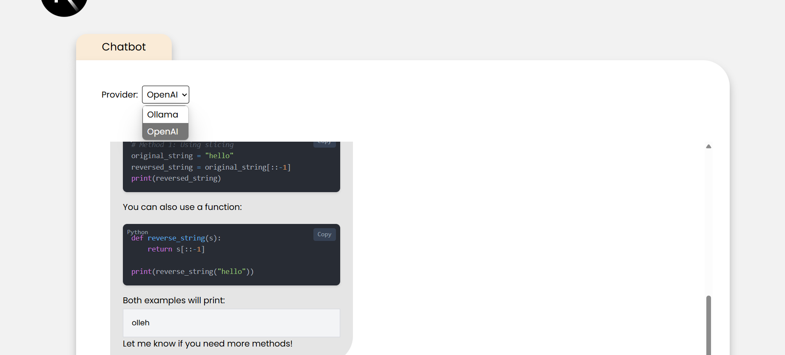
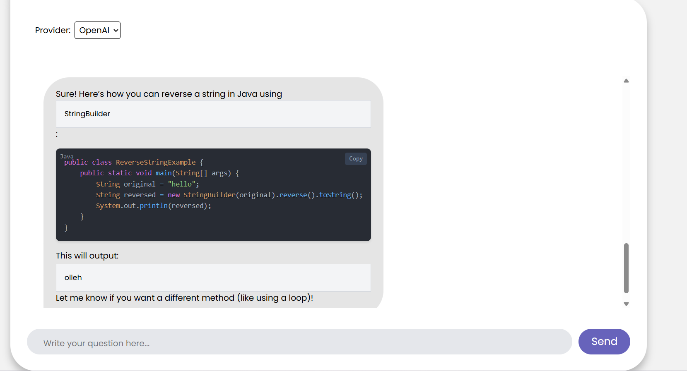
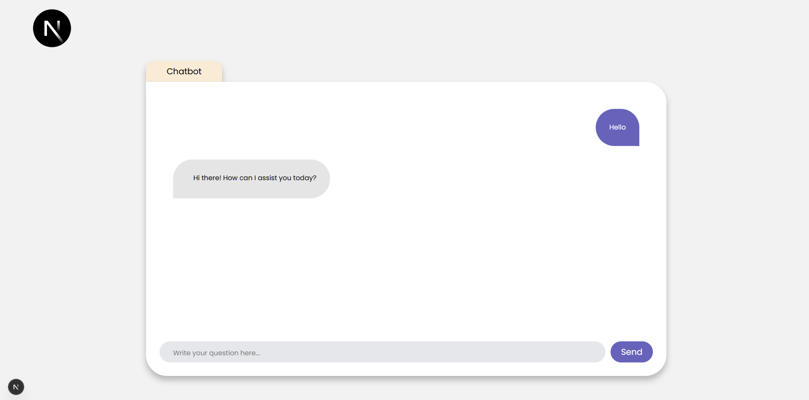
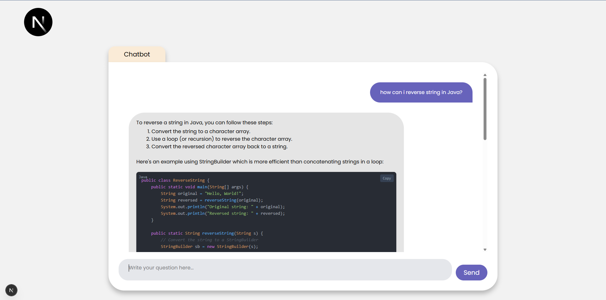
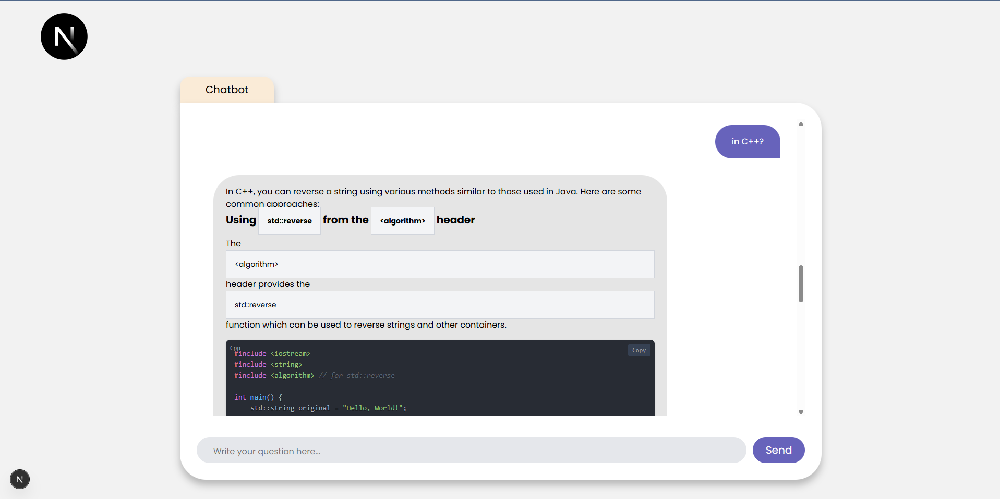
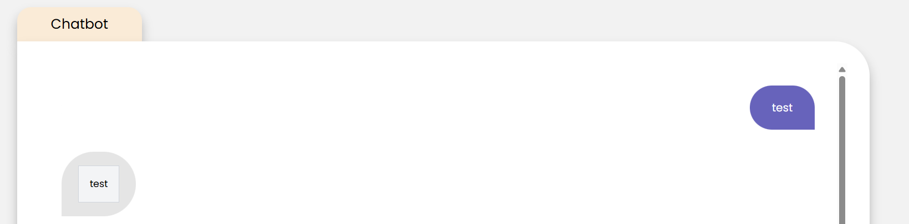

# Next.js Chatbot with local Ollama/OpenAI support W/ Tailwind

This is a [Next.js](https://nextjs.org) chatbot application that integrates with the [Ollama](https://ollama.com/) API to provide an interactive chat experience. The app features a modern UI with real-time message streaming, Markdown-formatted bot responses, and support for customizable AI models. It is built with TypeScript, React, and Next.js, styled with Tailwind-inspired CSS, and uses `react-markdown` for rich text rendering.




# old version (ollama only support)





## Features

- **Select Provider**: You can select OpenAI (API_key needed) or local Ollama config
- **AI-Powered Chat**: Communicates with an Ollama server to generate responses using models like `deepseek-coder-v2:latest`.
- **Real-Time Streaming**: Displays bot responses as they stream from the Ollama API.
- **Markdown Formatting**: Renders bot messages with Markdown support for headings, lists, code blocks, tables, bold/italic text, and links.
- **Responsive UI**: Clean, modern interface with user and bot message bubbles, optimized for desktop and mobile.
- **Configurable Model**: Allows specifying the Ollama model via a prop (e.g., `llama3.2`, `deepseek-coder-v2:latest`).
- **TypeScript Support**: Built with TypeScript for type safety and better developer experience.
- **Customizable Styling**: Uses Tailwind-inspired CSS classes for easy style customization.

## Prerequisites

- **Node.js**: Version 18 or higher.
- **Ollama**: Installed and running locally (or on a specified host). See [Ollama Installation](https://ollama.com/download).
- **Git**: For cloning the repository.
- **npm** or **yarn**: For managing dependencies.

## Getting Started

### 1. Clone the Repository

```bash
git clone https://github.com/csabika98/NextJS-AI-Chatbot.git
cd NextJS-AI-Chatbot.git
```

### 2. Install Dependencies

Install the required Node.js packages:

```bash
npm install
# or
yarn install
# or
pnpm install
```


Key dependencies include:
- `next`, `react`, `react-dom`: Core Next.js and React libraries.
- `react-markdown`, `remark-breaks`, `remark-gfm`: For Markdown rendering.
- `@next/font`: For font optimization (Poppins font).

### 3. Set Up Ollama

1. **Install Ollama**: Follow the instructions at [Ollama Download](https://ollama.com/download) to install Ollama on your machine.
2. **Start the Ollama Server**:
   ```bash
   ollama serve
   ```
   This runs the server at `http://localhost:11434` by default.
3. **Pull a Model**: Download the desired AI model (e.g., `deepseek-coder-v2:latest`):
   ```bash
   ollama pull deepseek-coder-v2:latest
   ```
   Verify available models:
   ```bash
   ollama list
   ```

### 4. Configure Environment Variables

Create a `.env` file in the project root to configure the Ollama server host:
Also you can set the OpenAI model + your API_KEY

```env
OLLAMA_HOST=http://localhost:11434
NEXT_PUBLIC_CHATBOT_MODEL_NAME=deepseek-coder-v2:latest
OPENAI_DEFAULT_MODEL=gpt-4.1-2025-04-14
OPENAI_API_KEY=
```

If using a different host or port, update the value accordingly.

### 5. SYSTEM PROMPT

Feel free to edit the base prompt.

1. Go to src/app/config/systemPrompt.ts

```ts
const SYSTEM_PROMPT = `You are a helpful assistant. If i type "test" you should answer "test" only, Format all responses in Markdown, using appropriate syntax for headings, lists, code blocks, tables, and other elements where applicable. Use single backticks (\`) for inline code (e.g., \`StringBuilder\`) and triple backticks (\`\`\`) with language identifiers for code blocks (e.g., \`\`\`java\ncode\n\`\`\`).`;

export default SYSTEM_PROMPT;
```



### 6. Run the Development Server

Start the Next.js development server:

```bash
npm run dev
# or
yarn dev
# or
pnpm dev
```

Open [http://localhost:5173](http://localhost:5173) in your browser to see the app.

### 7. Test the Chatbot

- Type a message in the input box and click "Send" or press Enter.
- The chatbot will respond with AI-generated text, formatted in Markdown (e.g., lists, code blocks, tables).
- Example queries:
  - "List three programming languages."
  - "Write a Python function to reverse a string."
  - "Create a table of animals and their habitats."

## Project Structure

Key files and directories:

- `app/page.tsx`: Main page component (`HomePage`) that renders the `ChatBox` component.
- `app/components/ChatBox.tsx`: Core chat interface with message rendering, input handling, and Ollama API integration.
- `app/utils/MessageManager.ts`: Utilities for managing chat messages (user and bot).
- `app/globals.css`: Global styles for the app, including Tailwind-inspired classes.
- `public/logo.svg`: Logo displayed in the header.

## Customization

Available models can be listed with `ollama list`. Pull new models with `ollama pull <model-name>`.

### Style Customization

Styles are defined in `app/globals.css` and inline in components. To modify the appearance:

- **Message Bubbles**: Update `userMessage` and `botMessage` classes in `ChatBox.tsx`.
- **Markdown Elements**: Adjust the `components` prop in `ReactMarkdown` to style lists, code blocks, tables, etc.
- **Global Styles**: Edit `app/globals.css` for app-wide changes.

Example: Change the bot message background color in `globals.css`:

```css
.botMessage {
  background-color: #d1d5db; /* New color */
}
```

### Add Features

- **Model Selector**: Add a dropdown to `HomePage` to let users choose the Ollama model dynamically.
- **User Markdown Input**: Enable Markdown rendering for user messages by applying `ReactMarkdown` to `msg.sender === 'user'`.
- **Syntax Highlighting**: Integrate `react-syntax-highlighter` for code block highlighting.

## Deployment

Deploy the app using the [Vercel Platform](https://vercel.com/new) for the easiest setup:

1. Push your repository to GitHub, GitLab, or Bitbucket.
2. Import the repository into Vercel.
3. Set the `NEXT_PUBLIC_CHATBOT_BACKEND_HOST` environment variable in Vercel to point to your Ollama server (e.g., a hosted instance).
4. Deploy the app.

Note: Ensure your Ollama server is publicly accessible or proxied for production deployments. Alternatively, use a backend proxy to handle API requests.

For more details, see the [Next.js Deployment Documentation](https://nextjs.org/docs/app/building-your-application/deploying).

## Troubleshooting

- **Ollama Server Not Running**: Ensure `ollama serve` is active and accessible at `http://localhost:11434`. Test with:
  ```bash
  curl http://localhost:11434/api/tags
  ```
- **Model Not Found**: Verify the model is pulled (`ollama list`) and matches the `model` prop in `page.tsx`.
- **Styles Broken**: Check that `app/globals.css` is imported in `app/layout.tsx` and contains the required classes (`chat-input-textarea`, `chat-btn`, `chat-container`).
- **No Response**: Inspect the browser console for API errors. Ensure the `askEndpoint` is correct and the Ollama server is reachable.

## Learn More

- [Next.js Documentation](https://nextjs.org/docs): Learn about Next.js features and APIs.
- [Ollama Documentation](https://github.com/ollama/ollama): Explore the Ollama API and available models.
- [React Markdown](https://github.com/remarkjs/react-markdown): Understand Markdown rendering options.
- [Vercel Font Optimization](https://nextjs.org/docs/app/building-your-application/optimizing/fonts): Details on using `@next/font`.
