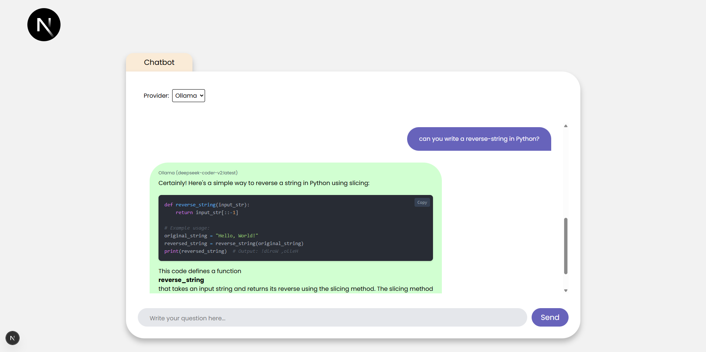

# Next.js Chatbot with local Ollama and OpenAI support with Tailwind

This is a [Next.js](https://nextjs.org) chatbot application that integrates with the [Ollama](https://ollama.com/) and OpenAI API 

## New version


## Legacy version





## Features

- **Select Provider**: You can select OpenAI (API_key needed) or local Ollama config
- **AI-Powered Chat**: Communicates with an Ollama server to generate responses using models like `deepseek-coder-v2:latest`.
- **Real-Time Streaming**: Displays bot responses as they stream from the Ollama API.
- **Markdown Formatting**: Renders bot messages with Markdown support for headings, lists, code blocks, tables, bold/italic text, and links.
- **Responsive UI**: Clean, modern interface with user and bot message bubbles, optimized for desktop and mobile.
- **Configurable Model**: Allows specifying the Ollama model via a prop (e.g., `llama3.2`, `deepseek-coder-v2:latest`).
- **TypeScript Support**: Built with TypeScript for type safety and better developer experience.
- **Customizable Styling**: Uses Tailwind-inspired CSS classes for easy style customization.

## Prerequisites

- **Node.js**: Version 18 or higher.
- **Ollama**: Installed and running locally (or on a specified host). See [Ollama Installation](https://ollama.com/download).
- **Git**: For cloning the repository.
- **npm** or **yarn**: For managing dependencies.

## It has a feedback system


## Getting Started

### 1. Clone the Repository

```bash
git clone https://github.com/csabika98/NextJS-AI-Chatbot.git
cd NextJS-AI-Chatbot.git
```

### 2. Install Dependencies

Install the required Node.js packages:

```bash
npm install
# or
yarn install
# or
pnpm install
```


Key dependencies include:
- `next`, `react`, `react-dom`: Core Next.js and React libraries.
- `react-markdown`, `remark-breaks`, `remark-gfm`: For Markdown rendering.
- `@next/font`: For font optimization (Poppins font).

### 3. Set Up Ollama

1. **Install Ollama**: Follow the instructions at [Ollama Download](https://ollama.com/download) to install Ollama on your machine.
2. **Start the Ollama Server**:

   ```bash
   ollama serve
   ```

   This runs the server at `http://localhost:11434` by default.
3. **Pull a Model**: Download the desired AI model (e.g., `deepseek-coder-v2:latest`):

   ```bash
   ollama pull deepseek-coder-v2:latest
   ```

   Verify available models:

   ```bash
   ollama list
   ```

### 4. Configure Environment Variables

Create a `.env` file in the project root to configure the Ollama server host:
Also you can set the OpenAI model + your API_KEY

These two are mandatory for Ollama:

```env
NEXT_PUBLIC_OLLAMA_HOST=http://localhost:11434
NEXT_PUBLIC_CHATBOT_OLLAMA_MODEL_NAME=deepseek-coder-v2:latest
```

These two are mandatory for OpenAI

```env
NEXT_PUBLIC_OPENAI_DEFAULT_MODEL=gpt-4.1-2025-04-14
NEXT_PUBLIC_OPENAI_API_KEY=<your_key>
```

You can combine them:

```env
NEXT_PUBLIC_OLLAMA_HOST=http://localhost:11434
NEXT_PUBLIC_CHATBOT_OLLAMA_MODEL_NAME=deepseek-coder-v2:latest
NEXT_PUBLIC_OPENAI_DEFAULT_MODEL=gpt-4.1-2025-04-14
NEXT_PUBLIC_OPENAI_API_KEY=
```

If using a different host or port, update the value accordingly.

### 5. SYSTEM PROMPT

Feel free to edit the base prompt.

1. Go to src/app/config/systemPrompt.ts

```ts
const SYSTEM_PROMPT = `You are a helpful assistant. If i type "test" you should answer "test" only, Format all responses in Markdown, using appropriate syntax for headings, lists, code blocks, tables, and other elements where applicable. Use single backticks (\`) for inline code (e.g., \`StringBuilder\`) and triple backticks (\`\`\`) with language identifiers for code blocks (e.g., \`\`\`java\ncode\n\`\`\`).`;

export default SYSTEM_PROMPT;
```


### 6. Test the Chatbot

- Type a message in the input box and click "Send" or press Enter.
- The chatbot will respond with AI-generated text, formatted in Markdown (e.g., lists, code blocks, tables).
- Example queries:
  - "List three programming languages."
  - "Write a Python function to reverse a string."
  - "Create a table of animals and their habitats."


### Style Customization

Styles are defined in `app/globals.css` and inline in components. To modify the appearance:

- **Message Bubbles**: Update `userMessage` and `botMessage` classes in `ChatBox.tsx`.
- **Markdown Elements**: Adjust the `components` prop in `ReactMarkdown` to style lists, code blocks, tables, etc.
- **Global Styles**: Edit `app/globals.css` for app-wide changes.

Example: Change the bot message background color in `globals.css`:

```css
.botMessage {
  background-color: #d1d5db; /* New color */
}
```

## Learn More

- [Next.js Documentation](https://nextjs.org/docs): Learn about Next.js features and APIs.
- [Ollama Documentation](https://github.com/ollama/ollama): Explore the Ollama API and available models.
- [React Markdown](https://github.com/remarkjs/react-markdown): Understand Markdown rendering options.
- [Vercel Font Optimization](https://nextjs.org/docs/app/building-your-application/optimizing/fonts): Details on using `@next/font`.
